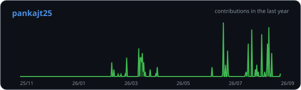
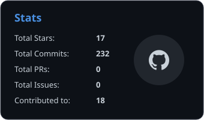
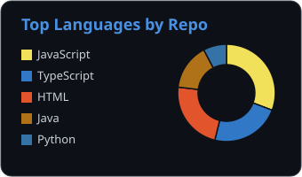
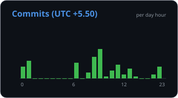

<h1>Hi there, I'm Pankaj 👋</h1>

Third-year B.Tech IT student | Building things, breaking things, fixing things

---

### 🚀 About Me

- 🎓 Currently pursuing B.Tech in Information Technology
- 💻 Working on projects across software design, theory of computation, and physics
- 🎯 Preparing for placements (product & service-based companies)
- 🌐 Exploring freelance web development for small businesses
- ⚡ Fun fact: this README survives even when the GitHub stats API doesn't 😄

---

### 🛠️ Tech Stack

  

---

### 📊 Profile Summary

<!--
  All cards below are static SVGs living in this repo — no external API
  calls, so they never break, rate-limit, or show broken images.
  Numbers are placeholders — edit the <text> values directly inside each
  .svg file whenever you want to update them.
-->

  

  

---

### 🔗 Connect with Me

  
  <!-- Add more: linkedin, twitter, etc. — just tell me your handles and I'll wire them in -->

---

  Thanks for stopping by — feel free to explore my pinned repos below ⬇️

