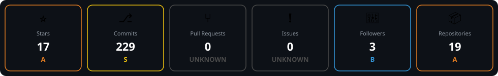

<h1>Hi there, I'm Pankaj 👋</h1>  

Third-year B.Tech IT student · Building things, breaking things, fixing things
  

  

  

 

 

## 🚀 About Me

- 🎓 Currently pursuing B.Tech in Information Technology
- 💻 Working on projects across software design, theory of computation, and physics
- 🎯 Preparing for placements (product & service-based companies)
- 🌐 Exploring new technologies and tools
- ⚡ Fun fact: this README keeps working even when the GitHub stats API doesn't 😄

 

## 🛠️ Tech Stack

  

 

## 📚 Currently Learning

<!--
  Update this list as your focus shifts — it's plain markdown, no
  workflow needed. Keep 3-5 items so it stays a quick scan, not a resume.
-->

- 🧠 Data Structures & Algorithms — sharpening for placement rounds
- 🏗️ System Design fundamentals
- ⚛️ Advanced React patterns (state management, performance)
- 🔐 Web security basics

 

## 💼 Featured Projects

<!--
  Curated picks — unlike GitHub's auto "Pinned" section below, this one
  you control: pick your 2-3 strongest projects and a one-line pitch
  instead of just a repo name. Add a Live Demo badge back in once a
  project is actually deployed.
-->

<table>
  <tr>
    <td width="50%">
      <h3 align="center">🛡️ WebGuard-scrapeverse</h3>
      
Self-healing web scraper — detects site changes and auto-repairs itself via GitHub Actions.

      

        
      

    </td>
    <td width="50%">
      <h3 align="center">🧠 Cerebro</h3>
      
Automation and agent-based tooling project.

      

        
      

    </td>

  </tr>
</table>

 

## 📊 Profile Summary

<!--
  Cards below are static SVGs generated by .github/scripts/generate_cards.py
  and regenerated automatically by .github/workflows/update-cards.yml on
  every push, daily on schedule, and on manual trigger — pulling real data
  from the GitHub API each time. No live API calls happen when this README
  itself is viewed, so it never shows broken images.
-->

<table align="center">
  <tr>
    <td colspan="2" align="center">
      
    </td>
  </tr>
  <tr>
    <td align="center" width="50%">
      
    </td>
    <td align="center" width="50%">
      
    </td>
  </tr>
  <tr>
    <td colspan="2" align="center">
      
    </td>
  </tr>
</table>

 

## 🐍 Contribution Snake

<!--
  Generated automatically by .github/workflows/snake.yml (uses the
  popular platane/snk action) — animates your real contribution graph
  eating itself, regenerated on the same daily schedule.
-->

  

 

## 🏆 GitHub Trophies

  

 

## 🔗 Connect with Me

  
  
  

 

## 💭 Thought of the Day

<!-- QUOTE:START -->
> Building things, breaking things, fixing things.
>
> — Pankaj
<!-- QUOTE:END -->

 

  Thanks for stopping by — feel free to explore my pinned repos below ⬇️

